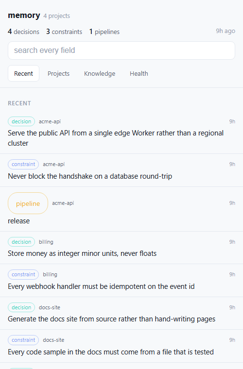
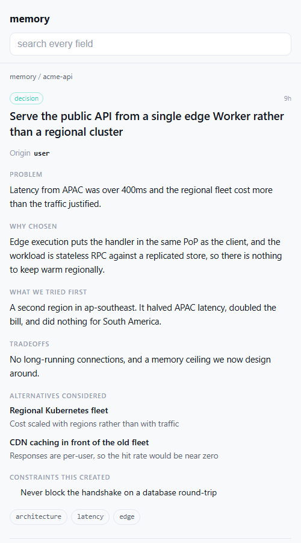
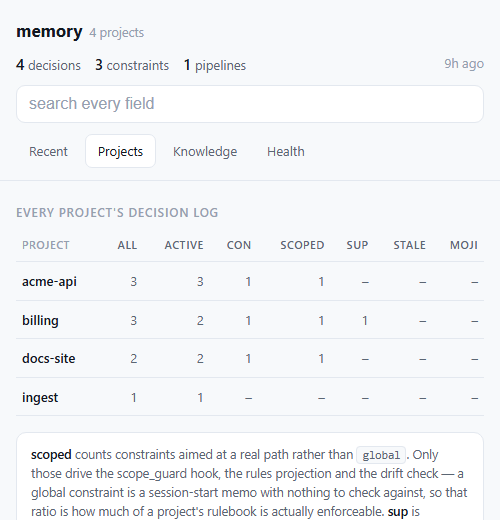
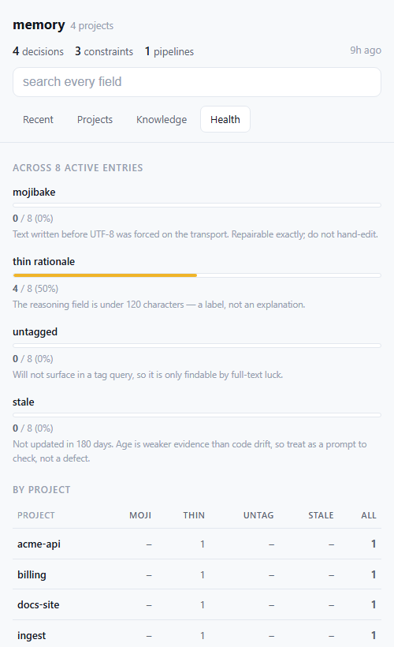

# context-keeper-remote

[](https://deploy.workers.cloudflare.com/?url=https://github.com/jarmstrong158/context-keeper-remote)

_Part of the [xylem](https://github.com/jarmstrong158/xylem) stack._

A remote [MCP](https://modelcontextprotocol.io) server on Cloudflare Workers that
exposes context-keeper's rationale store (decisions, pipelines, constraints) over
Streamable HTTP. It works as a **claude.ai custom connector**, including on mobile,
so your project's decisions and constraints are available from any Claude session —
no PC left running, no tunnel.

It also serves **[a phone app](#the-phone-view)** for reading that
store yourself: install it to your home screen once and it opens with no login and
no token in the URL. Tabs for recent activity, per-project counts, cambium
knowledge, and store health — and tapping any entry gives you the full rationale,
not just its title. Optional, opt-in, and on its own read-only credential.

**Self-host your own copy in a few clicks with the button above** — Cloudflare
copies this repo into your GitHub account, creates a fresh D1 database for you, and
deploys the Worker. Then you add one secret and paste a URL into Claude. Full
walkthrough below; every step is a click, no command line anywhere.

> The maintainer's own instance runs at
> `https://context-keeper-remote.jarmstrong158.workers.dev`. Yours will be at your
> own subdomain after you deploy.

### Why it's built this way

- **Worker, not tunnel** — no "PC must be on" dependency.
- **D1, not KV** — row-level writes and `WHERE` queries; two writers (desktop +
  mobile) don't clobber each other the way whole-file JSON read-modify-write does.
- **Stateless handler, no Durable Objects** — the tools are stateless RPCs against
  D1, so the Worker runs on the Cloudflare **free plan**.
- **Secret-path auth** — claude.ai custom connectors don't reliably send custom
  bearer headers, so the token is the last path segment of the URL. The URL is the
  credential.
- **Self-migrating** — the Worker creates its own D1 schema at runtime, so a
  brand-new empty database needs **no manual SQL** (verified by a cold-start test).

---

## Self-host it (one-click, no command line)

### Step 1 — Click "Deploy to Cloudflare"

Click the **Deploy to Cloudflare** button at the top of this page. Cloudflare will:

1. Ask you to authorize GitHub and pick an account — it **copies this repo into
   your GitHub account** (you get your own repo).
2. **Automatically create a new D1 database** in your Cloudflare account and bind it
   to the Worker. (This works because the Worker's config declares the database
   binding without a hard-coded id, so Cloudflare provisions a fresh one for you.)
3. Set up **Workers Builds** so every push to your new repo redeploys automatically.
4. Build and deploy the Worker.

When it finishes, your Worker is live at
`https://context-keeper-remote.<your-subdomain>.workers.dev`. Note that URL — you'll
need it in Step 3. (You can always find it under **Workers & Pages** in the
dashboard.)

> Nothing to configure in the repo, and **no SQL to run** — the database starts
> empty and the Worker creates its tables on the first request.

### Step 2 — Add the `AUTH_TOKEN` secret (Cloudflare dashboard)

The Worker refuses every request until it has an auth token, so set one:

1. Cloudflare dashboard → **Workers & Pages** → your **context-keeper-remote**
   Worker.
2. **Settings** → **Variables and Secrets** → **Add**.
3. Type: **Secret**. Name: `AUTH_TOKEN`. Value: a long random string (32+ characters
   — treat it like a password). Save/Deploy.

That value is your connector's password. Keep it somewhere safe; you'll paste it in
the next step.

<details>
<summary>Also deploying the companion <code>agentsync-remote</code> worker?</summary>

`agentsync-remote` uses the same `AUTH_TOKEN` scheme, and **additionally** needs, in
*its* Worker's **Variables and Secrets**:

- a **Secret** named `GH_PAT` — a GitHub personal access token, and
- a **Variable** named `REPO` — set to the `owner/repo` it should sync.

Those two do **not** apply to context-keeper-remote (this repo) — it only needs
`AUTH_TOKEN`. See the `agentsync-remote` README for its specifics.
</details>

### Step 3 — Add the custom connector in claude.ai

1. claude.ai → **Settings** → **Connectors** → **Add custom connector**.
2. Paste your Worker URL with the token as the final path segment:

   ```
   https://context-keeper-remote.<your-subdomain>.workers.dev/mcp/<AUTH_TOKEN>
   ```

   Replace `<your-subdomain>` with your Worker's subdomain (Step 1) and
   `<AUTH_TOKEN>` with the exact value you set (Step 2).
3. Save. The tools (`record_entry`, `get_context`, `query_entries`, …) are now
   available in your Claude sessions.

**Check it works:** ask Claude to call `get_project_summary`. If it answers, the
whole chain (deploy → auto-provisioned D1 → auto-migration → auth) is working.

### Step 4 — Migrate existing local data (optional)

If you already run local context-keeper, ask Claude (with the connector enabled) to
call **`import_entries`**, pasting each file's contents:

- `decisions.json` → `import_entries(project, kind="decision", entries=[...])`
- `pipelines.json` → `import_entries(project, kind="pipeline", entries=[...])`
- `constraints.json` → `import_entries(project, kind="constraint", entries=[...])`

Incoming ids are preserved; existing ids are reported, never overwritten.

### Step 5 — Install the phone view (optional)

Everything above is the MCP connector, which is for Claude to read. Step 5 is for
**you** to read it, from your phone. It needs a clone of this repo and Node 22+,
which is the only part of the setup that touches a command line — the connector
itself never does.

See [the phone view](#the-phone-view) below.

---

## The phone view

`/view` is a read-only, server-rendered page of every project's decisions and
constraints. Install it to your home screen and it opens like an app: no login,
no token in the URL, nothing to remember.

| | |
|---|---|
|  |  |
| **Recent** — what changed, across every project | **Any entry** — the reasoning, not just the title |
|  |  |
| **Projects** — counts per project, including how much of each rulebook is enforceable | **Health** — mojibake, thin rationale, untagged, stale |

<sub>Synthetic data. Every project and entry above is invented — see
[docs/screenshots](docs/screenshots/) for the dataset and how to regenerate these.</sub>

It has four tabs, matching the desktop dashboard:

| tab | what it answers |
|---|---|
| **Recent** | what changed lately, across every project |
| **Projects** | per-project counts: entries, active, constraints, **scoped**, supersession links, stale, mojibake |
| **Knowledge** | cambium's team/org counts, if wired (see below) |
| **Health** | mojibake, thin rationale, untagged, stale — as proportions and a per-project ranking |

Tap any row for the **full entry**: problem, why it was chosen, what was tried
first, tradeoffs, alternatives with the reason each was rejected, and — for
constraints — scope, hardness, and what enforces it. Search covers every field,
including the reasoning, which is usually where the answer is. Superseded entries
stay reachable, and each entry links to what it replaced and what replaced it.

### Install

**1. Create the credential.** Double-click `scripts/set-view-token.cmd`
(macOS/Linux: `scripts/set-view-token.sh`). From a terminal use the absolute path
— **not** `npm run`, which needs the repo as your current directory:

```bash
powershell -NoProfile -ExecutionPolicy Bypass -File "/full/path/to/context-keeper-remote/scripts/set-view-token.ps1"
```

One run generates the token, installs it, waits for the route to answer `200`,
copies the URL, opens it in your browser, and prints a **QR code**.

**2. Scan the QR with your phone**, then **Add to Home Screen**. Done.

Add `-DryRun` to run everything except the install, which is the fastest way to
check your setup before touching anything.

### It works offline, and a tap is instant

A service worker caches every page you open, cache-first with a background
revalidate. Measured on the live instance:

| | |
|---|---|
| served from cache | **1 ms** |
| forced to the network | 278–383 ms |

So it opens with no signal, and switching tabs is instant rather than a
round-trip. A decision log is not a live feed — showing yesterday's answer
immediately and correcting it a moment later beats showing nothing for 300ms,
and the header carries an "8h ago" stamp so stale data is never presented as
current.

**Only 200s are cached.** A `404` is what this Worker returns for an
unauthenticated or rotated credential, and caching one would mean a device that
rotated its token keeps being told it is signed out — from its own disk, with no
network involved and no obvious way to clear it. Verified in both directions.

**The token still never reaches JavaScript.** The cookie is `HttpOnly`, so the
service worker cannot read it; it only issues same-origin requests the browser
attaches it to. What was given up is "no client-side JS at all", not the
credential isolation. The CSP gains `script-src 'self'` and deliberately **not**
`'unsafe-inline'` — the registration lives in its own file so an inline
allowance, which would apply to the whole document including anything a recorded
entry smuggled past the escaper, is never needed.

### How it stays logged in

The token URL is an **enrolment** step, not a daily one. Visiting it sets a
long-lived `HttpOnly` cookie, and from then on the bare `/view` path works from
that device — which is what the home-screen icon opens.

- **Nothing is widened.** The cookie carries the same secret the path did and is
  compared the same way, so rotating `VIEW_TOKEN` still revokes every device at
  once. There is one revocation path, no session table, and no expiry to track.
- **Its own credential.** The view never accepts `AUTH_TOKEN`, and `/mcp` never
  accepts `VIEW_TOKEN`. A leaked view URL discloses decision summaries; it cannot
  write, deprecate, or delete.
- **Unset means gone.** With no `VIEW_TOKEN`, `/view/<anything>` returns a bare
  `404`, indistinguishable from a route that was never deployed.

`npm run view` reopens it later (the URL is saved to `.view-url`, gitignored).
`npm run view -- --qr` enrols another device **without** rotating the token —
re-running setup would mint a new one and silently drop every device already
added.

### Connect the Knowledge tab to cambium-remote (optional)

Only relevant if you also run [cambium-remote](https://github.com/jarmstrong158/cambium-remote).

```bash
scripts/connect-cambium.cmd
```

It generates a **status-only** credential, installs it on cambium-remote as
`STATUS_TOKEN`, verifies the route answers with real counts, and only then sets
`CAMBIUM_STATUS_URL` here. Nothing to look up or paste.

**Why a second credential rather than cambium's connector URL:** that URL is
cambium-remote's `AUTH_TOKEN`, which grants `recall` over every promoted item —
on the Worker whose team scope reaches every repo under `TEAM_OWNER`, including
private ones. Copying it here to render three integers would mean a leak of this
Worker discloses cambium's entire reach. `STATUS_TOKEN` reads the counts and
nothing else. It is also *generatable*, which is what makes the setup automatic;
`AUTH_TOKEN` can only ever be re-typed by hand, since Cloudflare stores secrets
write-only.

**Self-hosters must add a service binding.** A Worker **cannot** reach another
Worker by fetching its `workers.dev` hostname — Cloudflare's edge answers `404`
and the target never runs, which looks exactly like a rejected token. Add to your
`wrangler.toml`:

```toml
[[services]]
binding = "CAMBIUM"
service = "cambium-remote"
```

This repo declares it only under `[env.production]`, deliberately: a service
binding names its target, so declaring it at the top level would break the
one-click deploy for anyone whose account has no `cambium-remote`.

The panel fails soft. If cambium is slow (10s budget), down, or unwired, the page
still renders and says so. Only the Knowledge tab makes that call, so the other
tabs never pay for it.

### Deploy on push, with no API token

`git push` can deploy the Worker directly, using the wrangler login you already
have — no Cloudflare API token, no GitHub secret, no dashboard:

```bash
scripts/install-deploy-hook.cmd
```

It installs a git **pre-push** hook. Deploy first, push second: if the deploy
fails the push is aborted, so `origin` never receives a commit that could not be
deployed. That is the inverse of the failure it replaces — cambium-remote's CI
was accepting every merge and deploying none of them, with `main` drifting ahead
of the running Worker and nothing to show it.

Main only, skips branch deletes, `git push --no-verify` skips it once, `-Remove`
uninstalls.

**It refuses to install without `-Env` in a repo that has named environments**,
and that refusal is load-bearing rather than fussy. A bare `wrangler deploy` uses
the *top-level* profile — which in this repo is the self-host profile, and that
one deliberately omits `database_id` so Cloudflare provisions a **fresh empty
database**. A hook installed without `-Env` here would bind the live Worker to an
empty D1 on the next push. So:

```bash
# cambium-remote -- no named environments, bare deploy is correct
scripts/install-deploy-hook.cmd

# a repo whose real deploy lives under [env.production]
scripts/install-deploy-hook.cmd -Env production
```

This repo does not need the hook at all — its GitHub Actions deploy works, and a
hook would deploy twice per push.

**Why not just fix the CI?** Because that step genuinely cannot be automated.
GitHub Actions needs `CLOUDFLARE_API_TOKEN`, and minting a Cloudflare API token
through the API requires an existing token carrying *User API Tokens: Edit*.
Wrangler's OAuth login does not have it — its 29 scopes are workers/d1/pages/
queues operations plus `account:read`, with nothing token-management related. **No
credential on your machine can create that credential.** The paste is Cloudflare's
permission model, not a gap in the tooling. Deploying locally sidesteps the
question entirely.

### If you want GitHub Actions CI anyway

`connect-cambium` deploys cambium-remote itself when it finds the status route
missing, using the wrangler login you already have — so you do **not** need its
GitHub Actions deploy working for the Knowledge tab to work.

You only need it if you want cambium-remote to auto-deploy on every push. Its
workflow needs two Cloudflare secrets, and an empty one fails **silently**: every
merge looks green and deploys nothing.

```bash
scripts/fix-cambium-ci.cmd
```

`CLOUDFLARE_ACCOUNT_ID` is read from `wrangler whoami` and set automatically — it
is an identifier, not a credential; it is in every dashboard URL.

`CLOUDFLARE_API_TOKEN` you paste once, and that step is genuinely irreducible:
creating a Cloudflare API token requires an existing token with
*User API Tokens: Edit*, and wrangler's OAuth login is not one. **No credential on
your machine can mint that credential.** Everything around it is automated — the
browser opens on the right page, the token is read without echoing, it is
**verified against Cloudflare's API before being stored**, both secrets go over
stdin rather than argv, and the previously failed run is re-triggered so you watch
it go green instead of taking the script's word for it.

### Set your Worker URL (self-hosters)

No wrangler command reports the `workers.dev` host — not `whoami`,
`deployments list`, `versions list`, or `deployments status` — so it lives in
`package.json`:

```bash
node -e "const p=require('./package.json');p.contextKeeper.workerUrl='https://<worker>.<account>.workers.dev';require('fs').writeFileSync('package.json',JSON.stringify(p,null,2)+'
')"
```

The setup script reads it **before** installing anything and refuses to run
without it. That ordering is deliberate: a token installed with no URL to put it
in is unrecoverable, since Cloudflare cannot read a secret back.

### Platform support, honestly

| script | Windows | macOS / Linux |
|---|---|---|
| `set-view-token` | `.cmd` / `.ps1` | **`.sh`** |
| `connect-cambium` | `.cmd` / `.ps1` | not ported — see below |
| `install-deploy-hook` | `.cmd` / `.ps1` | not ported — see below |
| `fix-cambium-ci` | `.cmd` / `.ps1` | not ported — see below |

The three that aren't ported are thin wrappers around a handful of commands, so
the manual equivalents are short. **Connect cambium:**

```bash
TOKEN=$(head -c 32 /dev/urandom | base64 | tr '+/' '-_' | tr -d '=
')
printf '%s' "$TOKEN" | (cd ../cambium-remote && npx wrangler secret put STATUS_TOKEN)
# wait ~60s for the new version to roll out, then check it answers with counts:
curl -s "https://cambium-remote.<account>.workers.dev/status/$TOKEN" | head -c 200
printf '%s' "https://cambium-remote.<account>.workers.dev/status/$TOKEN"   | npx wrangler secret put CAMBIUM_STATUS_URL --env production
```

**Deploy on push** — write `.git/hooks/pre-push` in the target repo, LF endings,
`chmod +x`, running `npx wrangler deploy` (add `--env <name>` if that repo has
named environments — a bare deploy there targets the self-host profile and will
bind your live Worker to a fresh empty database).

**Fix the CI** — `gh secret set CLOUDFLARE_ACCOUNT_ID` and
`gh secret set CLOUDFLARE_API_TOKEN` against the repo, reading each from stdin.

### Editing the setup scripts

They target **Windows PowerShell 5.1** — the version that ships with Windows and
the one `.cmd` launches. Five things there are load-bearing and look like they
could be modernised:

- `RNGCryptoServiceProvider`, not `RandomNumberGenerator::Fill` — the latter is
  .NET Core only and throws.
- Manual `WebException` status extraction, not `-SkipHttpErrorCheck` — PowerShell 7 only.
- No `??`, `?.`, or ternaries — all PowerShell 7 only, and a **parse error** here.
- Every wrangler call goes through `Invoke-Wrangler`. On 5.1, `2>&1` on a *native*
  command wraps each stderr line in an ErrorRecord, and under
  `$ErrorActionPreference = 'Stop'` the first is **terminating** — so an ordinary
  wrangler notice kills the run.
- Confirmations gate on `[Console]::IsInputRedirected`, never
  `[Environment]::UserInteractive` (which is always true), and cast `Read-Host` to
  `[string]` before matching — `$null -notmatch '...'` evaluates to *empty*, not
  `$true`, so the obvious guard fails **open**.

Every run writes a scrubbed log (`.view-setup.log`, `.cambium-setup.log`) with the
token masked, so a failure can be read after the window closes.

## ⚠️ Security: the connector URL is a credential

The URL you paste into Claude **embeds `AUTH_TOKEN`** as its last path segment.
Anyone who has the full `…/mcp/<AUTH_TOKEN>` URL can read and write your entire
store. Treat it exactly like a password:

- Don't share it, screenshot it, or paste it anywhere it could be logged.
- Requests to any other path, or with the wrong token, get a bare `404` with no
  detail (a valid token used with a non-POST method gets `405`).
- **To rotate:** change `AUTH_TOKEN` in the Cloudflare dashboard (Step 2). This
  **immediately invalidates every old URL** — any connector using the previous
  token starts getting `404`s until you update it in claude.ai (Step 3) with the new
  value.

Everything in this section applies to the **view URL** too, with one difference in
your favour: `VIEW_TOKEN` can only read. A leaked view URL exposes every decision
summary in every project on the instance, which may well be the more sensitive half
— but it cannot write, deprecate, or delete anything. That is the entire reason the
two are separate credentials rather than one.

### Why the token is in the URL path, and what that costs you

This is a **deliberate design choice, not an oversight**. claude.ai custom
connectors do not reliably send custom headers, so an `Authorization:` header —
the obvious alternative — cannot be depended on. Putting the credential in the
path is what makes the connector work at all.

Be clear about the price, because it is not the same as a header:

- **URLs get recorded in places request bodies never do.** Browser history,
  shell history, proxy and CDN access logs, crash reports, bug reports,
  screenshots, "copy link" buttons, and **agent session transcripts**. During
  the audit that produced this section, the connector URLs for these Workers
  were found in **~54 occurrences across 13 local session transcripts** on a
  single machine — none of them pasted deliberately; they were simply part of
  the tool configuration an agent echoed back.
- **The Worker itself does not log it.** Every log line records the route as
  `/mcp/***`. The leak surface is everything *around* the Worker, which is
  exactly what you cannot audit.
- **A leaked token is full access, with no second factor and no per-caller
  identity.** There is nothing to revoke except the token itself, and no log
  that will tell you who used it.

**Practical guidance:**

1. **Rotate on a schedule**, not just on suspicion — assume the URL has been
   recorded somewhere you don't control. Rotation is cheap: change `AUTH_TOKEN`,
   update the connector.
2. **Rotate immediately** if you've shared a terminal recording, a transcript,
   a screen capture, or a bug report from a machine where the connector is
   configured.
3. Use a **long random token** (32+ bytes, e.g. `openssl rand -hex 32`). The
   comparison is constant-time in both content *and* length, so length is not
   observable — but entropy is still your only defence against guessing.
4. If you ever get the chance to use a header or OAuth instead, **take it**.
   This tradeoff is forced by the client, not preferred.

---

## Tools

Every tool takes an optional `project`; if omitted it falls back to the configured
`default_project` (set it once with `config` — `op='set'`, key `default_project`).

The unified tools (`config`, `record_entry`) are the current surface; the older
per-operation tools remain as **deprecated aliases** so existing callers keep
working. New work should prefer the unified tools.

| Tool | Purpose |
| --- | --- |
| `config` | Read or write config: `op='get'` reads a key, `op='set'` writes it (`value` required). Use key `default_project` (global scope, no `project`) to pick the project used when a call omits `project`. |
| `set_config` / `get_config` | **Deprecated** aliases for `config(op='set')` / `config(op='get')`. |
| `record_entry` | Unified write: record a `decision`, `constraint`, or `pipeline`. Required field depends on kind — decision needs `summary`, constraint needs `rule`, pipeline needs `name`. |
| `record_decision` | **Deprecated** alias for `record_entry(kind='decision')`: `summary`, `problem`, `why_chosen`, `what_we_tried`, `tradeoffs`, `tags`. |
| `record_constraint` | **Deprecated** alias for `record_entry(kind='constraint')`: a rule that must hold — `rule`, `reason`, `tags`. |
| `record_pipeline` | **Deprecated** alias for `record_entry(kind='pipeline')`: a reusable process — `name`, `purpose`, `steps` (extra fields kept verbatim). |
| `get_context` | Relevance-ranked retrieval for a query (keyword scoring; excludes deprecated unless `include_deprecated`). An entry that superseded something carries a one-line `predecessor` -- what the prior entry said and why it changed -- byte-identical to the local server's, so history reads the same over either transport. |
| `query_entries` | Structured filters: `id`, `kind`, `tags` (all must match), `status` (`active`/`deprecated`/`all`), free `text`, and `limit`. |
| `get_project_summary` | One-call orientation: entry counts by kind and status, the ids present, the active constraints (compact), and the most recent decisions. |
| `list_projects` | The org registry: every project with entries, plus per-project active counts (decisions/constraints/pipelines), active/deprecated totals, and last-updated time. Enumerates the whole org in one call — discover exact, case-sensitive project names instead of guessing. |
| `update_entry` | Merge `patch` fields into an entry's payload; optionally change `status`. |
| `deprecate_entry` | Mark deprecated, optionally linking `superseded_by` and recording a `reason` (the reason is what the predecessor line quotes). |
| `reload_constraints` | Compact list of the active constraints. |
| `prune_stale` | Delete old deprecated entries (**dry run by default**; pass `dry_run=false`). |
| `verify_quality` | Flag entries missing rationale-bearing fields. |
| `export_markdown` | Render entries as a DECISIONS.md-style document. |
| `import_entries` | Bulk import from the local JSON store format (preserves ids and lifecycle status including `superseded`, reports collisions, never overwrites). |
| `upsert_entries` | Bulk upsert in the local store format — the mirror-sync path. New ids are inserted; an existing id is replaced only when the incoming `updated_at` is strictly newer (last-writer-wins by timestamp), else skipped. Carries edits and deprecations between mirrored stores; never deletes. |

### Entry conventions

- **Decisions** use `summary`, `problem`, `why_chosen`, `what_we_tried`,
  `tradeoffs`, `tags`. The deprecated `rationale` field is accepted on input and
  mapped to `why_chosen` when `why_chosen` is absent.
- **Constraints** use `rule`, `reason`, `tags`.
- **Pipelines** use `name`, `purpose`, `steps`, plus any extra fields you pass.
- **ids** are per project+kind: `dec-001`, `pipe-003`, `con-012`. Because the same
  id recurs across projects, the D1 primary key is composite `(project, id)`.

---

## For maintainers / contributors

Everything above is for self-hosters. This section is for working on the code
itself.

### Config layout: how one repo serves both the button and CI

`wrangler.toml` has two profiles:

- **Default (top level)** — the D1 binding is declared **without** a `database_id`.
  This is what the Deploy button, `wrangler dev`, and the local test suite use. With
  no id, Cloudflare auto-provisions a fresh database for each self-hoster.
- **`[env.production]`** — pins the maintainer's real `database_id` and the Worker
  `name`. The maintainer's CI deploys with `wrangler deploy --env production` so it
  keeps hitting the same database and the same URL. Self-hosters never touch this
  env.

The **cambium service binding lives only in `[env.production]`**, and that split is
load-bearing rather than tidy. A service binding names its target Worker, so a
top-level `[[services]] service = "cambium-remote"` would make the one-click deploy
fail in any account that has no such Worker — which is every account but the
maintainer's. Anything that names another Worker, another database by id, or
another account belongs in the named env for the same reason.

Named environments **inherit nothing**. Every binding the production deploy needs
has to be repeated under `[env.production.*]`, including `[observability]`. A
binding that exists only at the top level is silently absent from the env CI
actually deploys.

### Deploy pipeline (maintainer only)

`.github/workflows/deploy.yml` runs on push to `main`, and is gated with
`if: github.repository == 'jarmstrong158/context-keeper-remote'` so forks (which
deploy via Workers Builds instead) don't run failing Actions. Steps: checkout →
Node 22 (Wrangler needs ≥ 22) → `npm ci` → `npm test` → `wrangler deploy --env
production`. Tests gate the deploy. It reads two GitHub repo secrets,
`CLOUDFLARE_API_TOKEN` (needs **Workers Scripts: Edit**) and `CLOUDFLARE_ACCOUNT_ID`
— **distinct** from the Worker's own `AUTH_TOKEN`.

### Local development

No network and no Cloudflare credentials required — tests run against a local
workerd D1 via `@cloudflare/vitest-pool-workers`. Requires **Node ≥ 22**.

```bash
npm install
npm test          # vitest: migrations, cold-start, CRUD, id sequencing, auth, import, ...
npm run typecheck # tsc --noEmit
```

### Live smoke test

After a deploy, from any machine with network access:

```bash
WORKER_URL="https://context-keeper-remote.<subdomain>.workers.dev/mcp/<AUTH_TOKEN>" \
  node scripts/smoke-test.mjs
```

Runs `initialize → tools/list → record_decision → query_entries` against the live
worker.

### Layout

```
src/index.ts             fetch handler: token check -> MCP dispatch (schema ensured lazily on first tools/call, not on the handshake)
src/mcp.ts               stateless Streamable HTTP MCP server (createMcpHandler)
src/db.ts                D1 access + runtime migration runner + id generation
src/entries.ts           payload normalization, insert-with-retry, keyword scoring
src/tools/*.ts           one module per tool group
src/view.ts              the phone view: shell, tabs, knowledge panel, dispatch on ?e/?p/?q/?t
src/detail.ts            entry detail, project drill-down, search, supersession trail
src/health.ts            quality flags + the Projects and Health tables
src/install.ts           enrolment cookie, web app manifest, home-screen icon
src/icon-data.ts         GENERATED by scripts/make-icon.mjs -- do not hand-edit
schema.sql               reference copy of the DDL the migration runner embeds
wrangler.toml            default (auto-provision) + [env.production] (pinned) config
.github/workflows/deploy.yml   test-then-deploy on push to main (maintainer repo)
scripts/smoke-test.mjs   live JSON-RPC round-trip check
scripts/set-view-token.*  create VIEW_TOKEN, verify, QR, save the URL  (.cmd = double-click)
scripts/connect-cambium.* generate STATUS_TOKEN on cambium-remote and wire it here
scripts/make-icon.mjs     regenerate the home-screen PNG (npm run make-icon)
test/                    vitest suite (local workerd D1, no network)
```

### Troubleshooting the maintainer deploy

| Symptom in the Actions log | Cause | Fix |
| --- | --- | --- |
| `Wrangler requires at least Node.js v22.0.0` | Node < 22 | Already set to Node 22 in `deploy.yml`. |
| `it's necessary to set a CLOUDFLARE_API_TOKEN environment variable` | Deploy secrets missing | Add both GitHub repo secrets. |
| `No route for that URI [code: 7000]` / `object identifier is invalid [code: 7003]` | API token lacks Workers permission, or wrong `CLOUDFLARE_ACCOUNT_ID` | Use an "Edit Cloudflare Workers" token; confirm the account id. |
| Deploys succeed but every call returns `404` | Worker `AUTH_TOKEN` not set, or the URL's token doesn't match it | Set/verify `AUTH_TOKEN` in the Cloudflare dashboard. |

---

## Related

- [context-keeper](https://github.com/jarmstrong158/context-keeper) — the local stdio original this Worker hosts as a remote transport.
- [xylem](https://github.com/jarmstrong158/xylem) — the stack this is part of.
